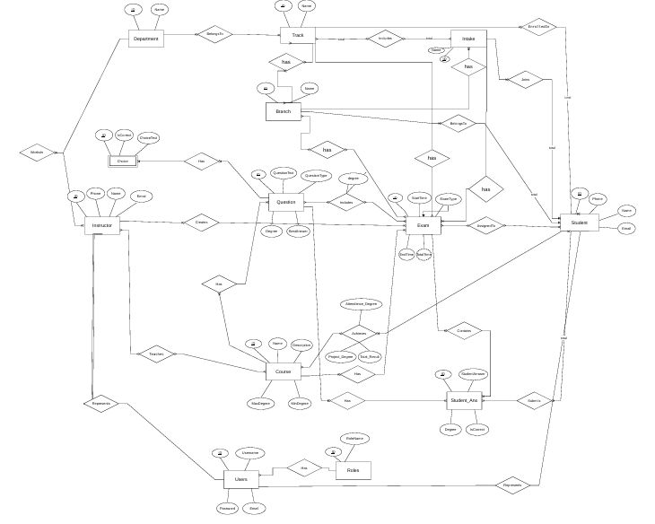

# 📚 Examination System Database Architecture

## 💡 Overview
This project is a comprehensive, enterprise-level relational database architecture designed for a full-scale online examination system using **Microsoft SQL Server**. It focuses on best practices in database design, performance optimization, and data security.

## ⚙️ Key Features & Implementations
* **Advanced Database Design:** Complete Entity-Relationship Diagram (ERD) and mapping schema.
* **Performance Optimization:** * Data separation using **Filegroups** (Static, Transactional, Indexes).
  * Implementation of strategic **Indexing** for faster query execution.
* **Backend Logic & Automation:**
  * Complex **Stored Procedures** for core system operations.
  * Smart **Triggers** for data validation and auto-correction.
  * Automated Exam Generation & Assignment logic.
* **Reporting & Analytics:** Utilized **Views** and **Functions** to generate insights on student pass/fail rates and instructor performance.
* **Security:** Role-based security, strict permissions, and an automated backup strategy.

## 📊 Entity-Relationship Diagram (ERD)

## 🛠️ Technologies Used
* Microsoft SQL Server (T-SQL)
* Database Normalization & Architecture
* Performance Tuning & Security

## 🤝 Acknowledgments
Developed in collaboration with my amazing teammates Omnia Shaaban and Mohamed Mostafa, under the guidance of our instructor Alyaa Khaled during our intensive training.
